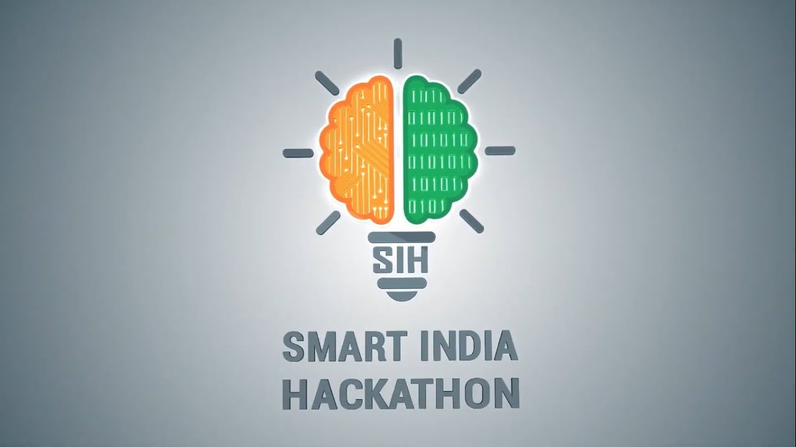

# authentIC - AI-Powered Counterfeit IC Detection System



## Overview

**authentIC** is an advanced AI-powered desktop application designed to detect counterfeit integrated circuits (ICs) using a comprehensive multi-stage detection pipeline. The system combines computer vision, machine learning, and large language models to provide accurate authenticity verification for electronic components.

## Features

### 🔍 **Multi-Stage Detection Pipeline**
- **IC Identification**: Automatic part number, manufacturer, and package type detection using Gemini Vision Language Model
- **Datasheet Retrieval**: Automated scraping and parsing of official OEM datasheets
- **Visual Analysis**: Advanced computer vision techniques including:
  - Dimension estimation using SAM (Segment Anything Model)
  - Pin counting with YOLO-based detection
  - Surface texture analysis with histogram filters
  - Anomaly detection and heatmap visualization
- **Gemini Visual Comparison**: Deep analysis comparing IC images against datasheet specifications
- **Comprehensive Reporting**: PDF reports with detailed findings, scores, and visualizations

### 🎯 **Key Capabilities**
- **Multi-View Analysis**: Support for multiple IC images from different angles
- **PCB Detection**: Detect and analyze multiple ICs on a PCB
- **RAG-Powered Search**: Vector database search for historical analysis patterns
- **Conversational Interface**: Natural language chat interface for queries and analysis
- **History Management**: Track and search through past detection sessions
- **Multi-User Support**: Separate storage for personal and business users

### 🛠️ **Advanced Tools**
- **Preprocessing Pipeline**: SAM-based segmentation, edge detection, and perspective correction
- **Histogram Filter Dashboard**: 11 different image processing filters for defect analysis
- **OCR Integration**: Text extraction from IC surfaces using EasyOCR
- **Dimension Estimation**: Precise measurement using SAM and reference objects

## Technology Stack

### Backend
- **Python 3.8+**
- **Flask**: REST API server
- **Google Gemini 2.5 Flash**: Vision language model for IC identification and analysis
- **PyTorch**: Deep learning framework
- **OpenCV**: Computer vision operations
- **YOLO (Ultralytics)**: Object detection for pin counting
- **SAM 2.1**: Image segmentation
- **EasyOCR**: Optical character recognition
- **PostgreSQL + pgvector**: Vector database for RAG search
- **ReportLab**: PDF report generation

### Frontend
- **Electron**: Desktop application framework
- **HTML/CSS/JavaScript**: Modern web UI
- **Supabase**: Authentication and backend services

## Installation

### Prerequisites
- Python 3.8 or higher
- Node.js 16+ and npm
- PostgreSQL 17+ (optional, for vector search)
- Google Gemini API key

### Backend Setup

1. **Clone the repository**
```bash
git clone https://github.com/Prisha8/counterfeit_IC.git
cd counterfeit_IC
```

2. **Install Python dependencies**
```bash
pip install -r requirements.txt
```

3. **Set up environment variables**
Create a `.env` file in the `backend/` directory:
```bash
GEMINI_API_KEY=your_gemini_api_key_here
DB_HOST=localhost  # Optional, for vector DB
DB_PORT=5432
DB_NAME=counterfeit_ic
DB_USER=your_username
DB_PASSWORD=your_password
```

4. **Download model weights** (if not already present)
- SAM 2.1 model weights
- YOLO pin counter weights (`pin_counter.pt`)
- PCB detector weights (`pcb_weights.pt`)
- EasyOCR models

### Frontend Setup

1. **Install Node.js dependencies**
```bash
npm install
```

2. **Start the Electron app**
```bash
npm start
```

### Optional: Vector Database Setup

For RAG-powered search functionality, set up PostgreSQL with pgvector:

```bash
# Install PostgreSQL 17
brew install postgresql@17
brew services start postgresql@17

# Install pgvector extension
brew install pgvector

# Create database
psql postgres
CREATE DATABASE counterfeit_ic;
\c counterfeit_ic
CREATE EXTENSION vector;
```

See `SETUP_VECTOR_DB.md` for detailed instructions.

## Usage

### Starting the Backend Server

```bash
cd backend
python api_server.py
```

The API server will start on `http://localhost:5000`

### Starting the Desktop Application

```bash
npm start
```

### API Endpoints

#### Detection
- `POST /api/detect` - Upload IC image(s) for analysis
- `GET /api/detect/<session_id>/status` - Check detection status
- `GET /api/detect/<session_id>/result` - Get detection results

#### Chat Interface
- `POST /api/chat` - Send conversational query
- `GET /api/chat/history/<session_id>` - Get chat history

#### History Management
- `GET /api/history` - List all detection sessions
- `GET /api/history/<session_id>` - Get detailed session data
- `POST /api/history/search` - Vector search through history
- `POST /api/history/<session_id>/verdict` - Update verdict

#### PCB Detection
- `POST /api/detect/pcb` - Detect multiple ICs on a PCB

### Command Line Interface

You can also run detection directly from the command line:

```bash
python backend/agents/counterfeit_detector.py <ic_image_path> --output-dir ./results
```

## Project Structure

```
counterfeit_IC/
├── backend/
│   ├── agents/
│   │   ├── counterfeit_detector.py    # Main detection orchestrator
│   │   ├── conversational_agent.py    # Chat interface agent
│   │   ├── gemini_ic_identifier.py    # IC identification agent
│   │   └── council_orchestrator.py    # Multi-model consensus
│   ├── tools/
│   │   ├── datasheet_scraper.py       # Datasheet retrieval
│   │   ├── datasheet_parser.py        # PDF parsing
│   │   ├── dimension_estimator.py     # SAM-based measurements
│   │   ├── pin_counter.py             # YOLO pin detection
│   │   ├── preprocessing_tool.py      # Image preprocessing
│   │   └── histogram_filter_tool.py   # Surface analysis
│   ├── utils/
│   │   ├── vlm_client.py              # VM endpoint client
│   │   ├── history_manager.py         # Session management
│   │   └── vector_db.py               # RAG search
│   ├── api_server.py                  # Flask REST API
│   └── weights/                       # Model weights directory
├── frontend/
│   ├── js/                            # Frontend JavaScript
│   ├── css/                           # Stylesheets
│   └── *.html                         # HTML pages
├── main.js                            # Electron main process
├── requirements.txt                   # Python dependencies
├── package.json                       # Node.js dependencies
└── README.md                          # This file
```

## Detection Pipeline

1. **IC Identification**: Gemini VLM analyzes the image to extract part number, manufacturer, package type, and pin count
2. **Datasheet Retrieval**: System searches for and downloads the official OEM datasheet
3. **Datasheet Parsing**: Extracts mechanical diagrams, dimensions, and specifications
4. **Preprocessing**: SAM segmentation, edge detection, perspective correction, and OCR
5. **CV Analysis**:
   - Dimension estimation using SAM
   - Pin counting with YOLO
   - Histogram filter analysis (11 filters)
   - Surface texture analysis
6. **Visual Comparison**: Gemini compares IC image against datasheet specifications
7. **Anomaly Detection**: Identifies defects, inconsistencies, and suspicious features
8. **Report Generation**: Creates comprehensive PDF report with findings

## VM Endpoint Integration

The system supports parallel calls to VM-hosted VLMs:
- **R-4B** (port 8000): IC identification
- **38B** (port 8001): Conversational agent
- **78B** (port 8002): Counterfeit detection

These endpoints are called in parallel with Gemini as a fallback mechanism.

**Note**: This project was developed for Smart India Hackathon 2025.
